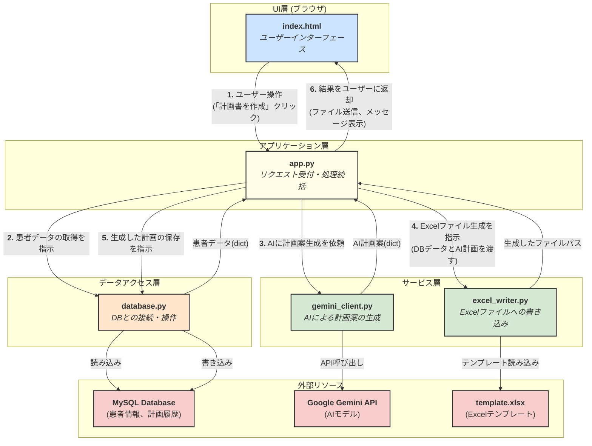

# リハビリテーション実施計画書 自動作成システム

## 1\. 概要 (Overview)

このアプリケーションは、リハビリテーション医療の現場における「リハビリテーション実施計画書」の作成を支援するためのWebシステムです。

データベースに登録された患者情報と、担当療法士が入力した所見を基に、Googleの生成AIであるGemini APIを利用して計画書の主要項目（方針、リスク、内容など）を自動生成します。最終的な成果物は、使い慣れたExcel形式の計画書としてダウンロードできます。

これにより、書類作成業務の効率化と、より質の高いリハビリテーション計画の立案をサポートします。

## 2\. 主な機能 (Features)

  - **WebベースのシンプルなUI**: ブラウザから患者を選択し、数クリックで計画書を作成できます。
  - **データベース連携**: 患者の基本情報や過去の計画書データをMySQLデータベースで管理します。
  - **AIによる計画案の自動生成**: Gemini APIを活用し、個々の患者データに応じた専門的な計画案（安静度・リスク、治療方針、治療内容など）を生成します。
  - **担当者の所見を反映**: 担当療法士の専門的な視点（特記事項や目標など）をプロンプトに組み込み、AIの生成精度を高めます。
  - **Excelファイル出力**: 生成された計画書を、指定のExcelテンプレートに書き込み、ダウンロード可能なファイルとして提供します。
  - **履歴保存**: 作成した計画書のデータはデータベースに保存され、将来の参照や分析に活用できます。

## 3\. システム構成図 (Architecture)



## 4\. 使用技術 (Technology Stack)

  - **バックエンド**: Python, Flask
  - **フロントエンド**: HTML, CSS, JavaScript
  - **データベース**: MySQL
  - **AIエンジン**: Google Gemini API
  - **Pythonライブラリ**: `flask`, `mysql-connector-python`, `google-generativeai`, `openpyxl`, `python-dotenv`

## 5\. セットアップと実行方法 (Getting Started)

### 5.1. 前提条件

  - Python 3.8 以降
  - MySQLサーバーが起動していること
  - Google Cloud Platform(Google AI Stadio https://aistudio.google.com/apikey )でAPIキーを取得済みであること

### 5.2. セットアップ手順

**1. リポジトリのクローン**

```bash
git clone https://github.com/YouSayH/kcr_Rehab-Plan-Generator.git
cd kcr_Rehab-Plan-Generator
```

**2. Python仮想環境の作成と有効化**
依存関係を管理するため、仮想環境を作成します。`.gitignore`には`venv_rehab`が指定されています。

```bash
# Windows
python -m venv venv_rehab
.\venv_rehab\Scripts\activate

# macOS / Linux
python3 -m venv venv_rehab
source venv_rehab/bin/activate
```

**3. 依存ライブラリのインストール**
`requirements.txt` を使って、必要なライブラリを一括でインストールします。

```bash
pip install -r requirements.txt
```

**4. `.env`ファイルの作成と設定**
APIキーなどの機密情報を格納するため、手動で`.env`ファイルを作成します。このファイルは`.gitignore`によりリポジトリから除外されています。

```
# .envファイルに以下の内容を記述し、自身の環境に合わせて値を設定してください
# --- データベース接続情報 ---
DB_HOST="localhost"
DB_USER="your_db_user"
DB_PASSWORD="your_db_password"
DB_NAME="rehab_db"

# --- Google APIキー ---
GOOGLE_API_KEY="your_google_api_key_here"
```

**5. データベースのセットアップ**
MySQLサーバーに接続し、`schema.sql` ファイルを実行して、データベース、テーブル、およびサンプルデータを作成します。

```bash
mysql -u your_user -p < schema.sql
```

**6. アプリケーションの起動**
以下のコマンドでFlask開発サーバーを起動します。

```bash
python app.py
```

起動後、Webブラウザで `http://127.0.0.1:5000` にアクセスしてください。

## 6\. ファイル構成 (File Structure)

```
C:.
│  .env                   # 【要手動作成】環境変数ファイル (Git管理外)
│  .gitignore             # Gitの無視設定ファイル
│  app.py                 # Flaskアプリケーションのメインファイル
│  database.py            # DBとの接続・操作モジュール
│  excel_writer.py        # Excelファイル生成モジュール
│  flow.md                # システム構成図 (Mermaid)
│  gemini_client.py       # Gemini APIとの通信モジュール
│  README.md              # このファイル
│  requirements.txt       # Pythonの依存ライブラリリスト
│  schema.sql             # DBスキーマ定義とサンプルデータ
│  template.xlsx          # 計画書のExcelテンプレート
│
├─output/                 # 【自動生成】生成されたExcelファイルの保存先 (Git管理外)
│      ...
│
└─templates/
      index.html          # フロントエンドのHTMLテンプレート
```

## 7\. 注意事項 (Notes)

  - このシステムはプロトタイプです。`app.py` 内の `SECRET_KEY` は、本番環境で運用する際には必ず複雑で安全なものに変更してください。
  - `app.py` はFlaskの開発用サーバーで動作します。本番環境では、GunicornやuWSGIなどのWSGIサーバーを使用することを強く推奨します。
  - `gemini_client.py` の `USE_DUMMY_DATA` フラグを `True` にすると、APIを呼び出さずにテスト用のダミーデータを使用できます。