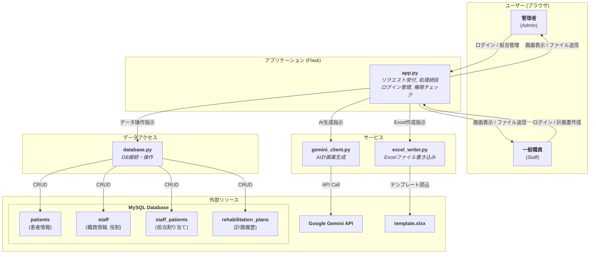

# TODOリスト https://docs.google.com/spreadsheets/d/1LUPwF4_KGJmqr2arcKsvYtvXsHZAtH2LK5qUAqHK1d0/edit?gid=1386834576#gid=1386834576
終わったタスクはチェックボックスをtrueにし、実施者がだれか明記&コミット名を書いていただけると幸いです。 <br><br>

# リハビリテーション実施計画書 自動作成システム


## 1\. 概要 (Overview)

このアプリケーションは、リハビリテーション医療の現場における「リハビリテーション実施計画書」の作成を支援するためのWebシステムです。

データベースに登録された患者情報と、担当療法士が入力した所見を基に、Googleの生成AIであるGemini APIを利用して計画書の主要項目（方針、リスク、内容など）を自動生成します。完成した計画書は、使い慣れたExcel形式でダウンロードできます。


-----

## 2\. 主な機能 (Features)

  * **WebベースのシンプルなUI**: ブラウザから担当患者を選択し、数クリックで計画書を作成できます。
  * **AIによる計画案の自動生成**: Gemini APIを活用し、個々の患者データに応じた専門的な計画案を生成します。
  * **担当者の所見を反映**: 担当療法士の専門的な視点をプロンプトに組み込み、AIの生成精度を高めます。
  * **Excelファイル出力**: 生成された計画書を、指定のExcelテンプレートに書き込み、ダウンロードできます。
  * **安全なユーザー管理とログイン機能**:
      * 職員ごとにアカウントを発行し、安全なログイン・ログアウト機能を提供します。
      * パスワードはハッシュ化してデータベースに保存され、セキュリティが確保されます。
  * **管理者権限による高度な管理**:
      * 管理者(admin)は、新しい職員アカウントの登録や削除が可能です。
      * どの職員がどの患者を担当するかを、管理画面で自由に割り当て・解除できます。
  * **権限に基づいたアクセス制御**:
      * 一般の職員は、自身に割り当てられた患者の情報にのみアクセスし、計画書を作成できます。
  * **計画書の履歴保存**: 作成した計画書のデータはデータベースに保存され、将来の参照や分析に活用できます。

-----

## 3\. システム構成図 (Architecture)



-----

## 4\. 使用技術 (Technology Stack)

  * **バックエンド**: Python, Flask, Flask-Login
  * **フロントエンド**: HTML, CSS, JavaScript
  * **データベース**: MySQL
  * **AIエンジン**: Google Gemini API
  * **Pythonライブラリ**: `flask`, `flask-login`, `PyMySQL`, `werkzeug`, `google-generativeai`, `openpyxl`, `python-dotenv`

-----

## 5\. セットアップと実行方法 (Getting Started)

### 5.1. 前提条件

  * Python 3.8 以降
  * MySQL Server
  * Google Gemini APIキー  (Google AI Stadio https://aistudio.google.com/apikey )

### 5.2. セットアップ手順

#### **ステップ1：リポジトリのクローンと移動**

```bash
git clone https://github.com/YouSayH/kcr_Rehab-Plan-Generator.git
cd kcr_Rehab-Plan-Generator
```

#### **ステップ2：Python仮想環境の作成と有効化**

```bash
# Windows
python -m venv venv_rehab
.\venv_rehab\Scripts\activate

# macOS / Linux
python3 -m venv venv_rehab
source venv_rehab/bin/activate
```

#### **ステップ3：依存ライブラリのインストール**

```bash
pip install -r requirements.txt
```

#### **ステップ4：`.env`ファイルの作成**

APIキーなどの機密情報を格納するため、プロジェクトのルートに`.env`という名前のファイルを手動で作成し、以下の内容を記述します。値はご自身の環境に合わせてください。

```
# --- データベース接続情報 ---
DB_HOST="localhost"
DB_USER="your_db_user" #rootでおそらくOK
DB_PASSWORD="your_db_password"
DB_NAME="rehab_db"

# --- Google APIキー ---
GOOGLE_API_KEY="your_google_api_key_here" 
```


#### **ステップ5：データベースの構築と管理者アカウントの作成** ⚙️

このステップは、アプリケーションのデータを保存する場所を用意し、最初にログインする管理者アカウントを設定する**非常に重要な手順**です。

**5-A. (Windows利用者向け) ターミナルの文字コード設定**
まず、ターミナル（コマンドプロンプトやPowerShell）で以下のコマンドを実行し、文字コードを`UTF-8`に設定します。**これは日本語の文字化けを防ぐために必須です。**

```bash
chcp 65001
```

**5-B. 最初の管理者用パスワードを生成する**
次に、管理者アカウントのパスワードを安全な「ハッシュ値」に変換します。ターミナルで以下のコマンドを実行してください。`<>`の部分は、あなたが決めたい安全なパスワードに置き換えます。

```bash
python create_hash.py <管理者用の好きなパスワード>
```

**実行例:**

```bash
python create_hash.py MySecureAdminPass123
```

実行すると、`scrypt:...`で始まる長い文字列（ハッシュ値）が表示されます。**このハッシュ値をコピーしてください。**

**5-C. `schema.sql`にハッシュ値を貼り付ける**
`schema.sql`ファイルを開き、末尾にある`staff`テーブルへの`INSERT`文を探します。そして、**コピーしたハッシュ値を指定の場所に貼り付け**てください。

```sql
-- 変更前
INSERT INTO staff (`id`, `username`, `password`, `role`)
VALUES (1, 'admin', 'ここに先ほどコピーしたハッシュ値を貼り付け', 'admin')
-- ...
```

**`'ここに先ほどコピーしたハッシュ値を貼り付け'`** の部分を、先ほど生成したハッシュ値に置き換えます。

**5-D. データベースを構築する**
ターミナルから以下のコマンドを実行し、`schema.sql`の内容をデータベースに反映させます。`<your_user>`はMySQLのユーザー名です。

```bash
mysql -u <your_user> -p < schema.sql
```

コマンド実行後、パスワードを求められるので入力します。エラーが出なければ、データベースの準備は完了です。

#### **ステップ6：アプリケーションの起動** 🚀

```bash
python app.py
```

起動後、Webブラウザで **`http://127.0.0.1:5000`** にアクセスしてください。ログイン画面が表示されます。

#### **ステップ7：最初のログイン**

`schema.sql`で設定した管理者アカウント（ユーザー名: `admin`、パスワード: ステップ5-Bで決めたもの）でログインしてください。

-----

## 6\. ファイル構成 (File Structure)

```
/Rehab-Plan-Generator
│  .env                   # 【要手動作成】環境変数ファイル
│  app.py                 # Flaskアプリケーション本体
│  database.py            # DB操作モジュール
│  excel_writer.py        # Excel生成モジュール
│  gemini_client.py       # Gemini API通信モジュール
│  create_hash.py         # パスワードハッシュ生成スクリプト
│  README.md              # このファイル
│  requirements.txt       # 依存ライブラリリスト
│  schema.sql             # DBスキーマ定義とサンプルデータ
│  template.xlsx          # Excelテンプレート
│
├─/output/                # 【自動生成】生成されたExcelファイルの保存先
│
├─/static/
│      style.css          # 共通スタイルシート
│
└─/templates/
       index.html         # トップページ
       login.html         # ログインページ
       signup.html        # 新規職員登録ページ (管理者用)
       confirm.html       # 計画書確認・修正ページ
       manage_assignments.html # 担当割り当て・職員管理ページ (管理者用)
       download_and_redirect.html # ダウンロード処理用ページ
```

-----

## 7\. トラブルシューティング (Troubleshooting) 🛠️

  * **エラー: `(1049, "Unknown database 'rehab_db'")`**

      * **原因**: データベースが作成されていません。
      * **解決策**: 上記「ステップ5」の手順を正しく実行してください。

  * **エラー: `ERROR 1406 (Data too long)` や `Incorrect string value`**

      * **原因**: データベースまたはターミナルの文字コードが日本語に対応していません。
      * **解決策**: 「ステップ5-A」の文字コード設定(`chcp 65001`)を必ず実行してください。また、`schema.sql`ファイルが`UTF-8`で保存されていることを確認してください。

  * **ログインできない場合**

      * **原因**: `schema.sql`に設定したパスワードのハッシュ値が間違っている可能性があります。
      * **解決策**: 「ステップ5-B」と「5-C」を再度慎重に行い、正しいハッシュ値がデータベースに登録されているか確認してください。

-----

## 8\. 注意事項 (Notes)

  * このシステムはプロトタイプです。`app.py` 内の `SECRET_KEY` は、本番環境で運用する際には必ず複雑で安全なものに変更してください。
  * 本番環境では、GunicornやuWSGIなどのWSGIサーバーを使用することを強く推奨します。
  * `gemini_client.py` の `USE_DUMMY_DATA` フラグを `True` にすると、APIを呼び出さずにテスト用のダミーデータを使用できます。