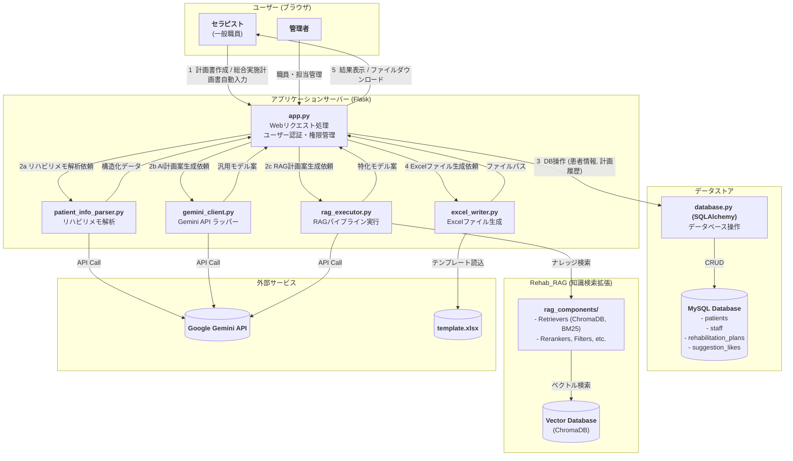

# TODOリスト https://docs.google.com/spreadsheets/d/1LUPwF4_KGJmqr2arcKsvYtvXsHZAtH2LK5qUAqHK1d0/edit?gid=1386834576#gid=1386834576
終わったタスクはチェックボックスをtrueにし、実施者がだれか明記&コミット名を書いていただけると幸いです。 <br><br>

# リハビリテーション実施計画書 自動作成システム


## 1\. 概要 (Overview)

データベースに登録された患者情報と、担当療法士が入力した所見を基に、Googleの生成AIであるGemini APIを利用して計画書の主要項目（方針、リスク、内容など）を自動生成します。さらに、**RAG (Retrieval-Augmented Generation)** 技術を導入し、専門的なガイドライン文書を知識源として参照することで、より高精度で根拠に基づいた計画案の生成も可能です。

完成した計画書は、使い慣れたExcel形式でダウンロードできます。

-----

## 2. 主な機能 (Features)

このシステムは、リハビリテーション計画書作成のワークフローを効率化し、質を高めるための多彩な機能を搭載しています。

### 🧑‍⚕️ 患者情報入力支援 (Patient Information Input Support)

* **AIによる患者情報の自動入力機能**
    日々のリハビリ実施時のメモや申し送り事項などの自由記述テキストをコピー＆ペーストするだけで、AIが内容を解析。患者の動作などの情報を自動で抽出し、フォームの各項目に振り分けます。これにより、煩雑な手入力を大幅に削減します。

* **患者情報マスタ管理**
    新規患者の登録や、既存の患者情報の編集を行うための専用画面を用意しています。AIによる自動入力結果の修正や、評価項目の更新などをいつでも行うことができます。

### 🤖 AIによる計画書作成支援 (AI-Assisted Plan Creation)

* **デュアルAIモデルによる提案**
    目的の異なる2種類のAIモデルが、計画書の各項目に対して同時に提案を生成します。
    1.  **通常モデル**: 患者の全体的な情報（年齢、診断名、ADLなど）から、臨床的に妥当な計画案を幅広く生成します。
    2.  **特化モデル (RAG)**: 臨床ガイドラインなどの専門文書を知識源として参照し、よりエビデンスに基づいた、専門性の高い計画案を生成します。

* **提案比較とフィードバック機能**
    生成された2つのAI提案を画面上で簡単に切り替えて比較できます。より良いと感じた提案を「いいね」ボタンで評価することができ、このフィードバックは将来のAIモデル改善に活用されます。

* **非同期ストリーミング表示**
    AIが計画書を生成する際、完成した項目から順次リアルタイムで画面に表示します。全ての生成が終わるのを待つ必要がなく、すぐに内容の確認や編集作業を開始できるため、時間的なストレスを軽減します。

### 📂 データ管理と出力 (Data Management & Output)

* **計画書履歴の保存と閲覧**
    作成・保存された全ての計画書はデータベースに履歴として記録されます。患者情報マスタ画面から過去の計画書にいつでもアクセスし、内容を閲覧することができます。

* **Excelファイル出力**
    最終的に確定した計画書は、院内の公式書式に基づいたExcelファイルとしてダウンロードできます。これにより、印刷や電子カルテへの添付が容易になります。

### 🔒 セキュアなユーザー管理 (Secure User Management)

* **職員アカウントと権限管理**
    Flask-Loginを用いた堅牢なログイン機能を実装。パスワードは安全にハッシュ化して保存されます。管理者(admin)と一般職員(general)の役割（ロール）があり、利用できる機能を制限しています。

* **担当制によるアクセス制御**
    管理者は、どの職員がどの患者を担当するかをWeb画面から簡単に割り当て・解除できます。一般職員は、自分に割り当てられた患者の情報のみ閲覧・操作が可能で、担当外の患者情報にはアクセスできません。

-----

## 3\. システム構成図 (Architecture)



-----

## 4\. 使用技術 (Technology Stack)

  * **バックエンド**: Python, Flask, Flask-Login, SQLAlchemy
  * **フロントエンド**: HTML, CSS, JavaScript
  * **データベース**: MySQL, ChromaDB (ベクトルデータベース)
  * **AIエンジン**: Google Gemini API
  * **RAGパイプライン**:
      * **Embedding**: Sentence-Transformers, Gemini Embedding API
      * **キーワード検索**: BM25 (rank-bm25)
      * **リランキング**: Cross-Encoder (sentence-transformers)
      * **フィルタリング**: NLI (transformers)
      * **評価**: Ragas
      * **ナレッジグラフ**: Neo4j
      * **オーケストレーション** LangChain(一部使用)
  * **Pythonライブラリ**: `PyMySQL`, `openpyxl`, `pydantic`, `python-dotenv`

-----

## 5\. セットアップと実行方法 (Getting Started)

### 5.1. 前提条件

  * Python 3.8 以降
  * MySQL Server
  * Google Gemini APIキー  (Google AI Stadio https://aistudio.google.com/apikey )

### 5.2. セットアップ手順

#### **ステップ1：リポジトリのクローンと移動**

```bash
git clone https://github.com/YouSayH/kcr_Rehab-Plan-Generator.git
cd kcr_Rehab-Plan-Generator
```

#### **ステップ2：Python仮想環境の作成と有効化**

```bash
# Windows
python -m venv venv_rehab
.\venv_rehab\Scripts\activate

# macOS / Linux
python3 -m venv venv_rehab
source venv_rehab/bin/activate
```

#### **ステップ3：依存ライブラリのインストール**

```bash
pip install -r requirements.txt
```

#### **ステップ4：`.env`ファイルの作成**

APIキーなどの機密情報を格納するため、プロジェクトのルートに`.env`という名前のファイルを手動で作成し、以下の内容を記述します。値はご自身の環境に合わせてください。

```
# --- データベース接続情報 ---
DB_HOST="localhost"
DB_USER="your_db_user" #rootでおそらくOK
DB_PASSWORD="your_db_password"
DB_NAME="rehab_db"

# --- Google APIキー ---
GOOGLE_API_KEY="your_google_api_key_here" 
```


#### **ステップ5：データベースの構築と管理者アカウントの作成** ⚙️

このステップは、アプリケーションのデータを保存する場所を用意し、最初にログインする管理者アカウントを設定する**非常に重要な手順**です。

**5-A. (Windows利用者向け) ターミナルの文字コード設定**
まず、ターミナル（コマンドプロンプトやPowerShell）で以下のコマンドを実行し、文字コードを`UTF-8`に設定します。**これは日本語の文字化けを防ぐために必須です。**

```bash
chcp 65001
```

**5-B. 最初の管理者用パスワードを生成する**
次に、管理者アカウントのパスワードを安全な「ハッシュ値」に変換します。ターミナルで以下のコマンドを実行してください。`****`の部分は、あなたが決めたい安全なパスワードに置き換えます。

```bash
Create-Hash.ps1
```

**実行例:**

```bash
Create-Hash.ps1
仮想環境を有効化しました。

PowerShell credential request
ハッシュ化したいパスワードを入力してください
Password for user password: ****

--- Pythonスクリプトを実行します ---
生成されたハッシュ値: scrypt:1234567890qwertyuiopasdfghjklzxcvbnm
------------------------------------
```

実行すると、`scrypt:...`で始まる長い文字列（ハッシュ値）が表示されます。**このハッシュ値をコピーしてください。**

**5-C. `schema.sql`にハッシュ値を貼り付ける**
`schema.sql`ファイルを開き、末尾にある`staff`テーブルへの`INSERT`文を探します。そして、**コピーしたハッシュ値を指定の場所に貼り付け**てください。

```sql
-- 変更前
INSERT INTO staff (`id`, `username`, `password`, `role`)
VALUES (1, 'admin', 'ここに先ほどコピーしたハッシュ値を貼り付け', 'admin')
-- ...
```

**`'ここに先ほどコピーしたハッシュ値を貼り付け'`** の部分を、先ほど生成したハッシュ値に置き換えます。

**5-D. データベースを構築する**
ターミナルから以下のコマンドを実行し、`schema.sql`の内容をデータベースに反映させます。`<your_user>`はMySQLのユーザー名です(`root`でいいと思います。)。

```bash
mysql -u <your_user> -p
# あなたのパスワードを入力後
source schema.sql
```

コマンド実行後、パスワードを求められるので入力します。その後、sqlファイルを読み込み、エラーが出なければ、データベースの準備は完了です。

#### **ステップ6：アプリケーションの起動** 🚀

```bash
python app.py
```

起動後、Webブラウザで **`http://127.0.0.1:5000`** にアクセスしてください。ログイン画面が表示されます。

#### **ステップ7：最初のログイン**

`schema.sql`で設定した管理者アカウント（ユーザー名: `admin`、パスワード: ステップ5-Bで決めたもの）でログインしてください。


-----

## 6\. ファイル構成 (File Structure)

```
/kcr_Rehab-Plan-Generator
│
│  app.py                 # Flaskアプリケーション本体
│  database.py            # DB操作モジュール (SQLAlchemy)
│  gemini_client.py       # Gemini API通信モジュール
│  patient_info_parser.py # カルテテキスト解析モジュール
│  excel_writer.py        # Excel生成モジュール
│  schema.sql             # DBスキーマ定義
│  requirements.txt       # 依存ライブラリ
│  template.xlsx          # Excelテンプレート
│  .env                   # 【要手動作成】環境変数ファイル
│
├─/Rehab_RAG/             # RAG(検索拡張生成)の実験・評価用サブモジュール
│  └─/source_documents/  # RAGが参照する知識源ドキュメントを格納
│
├─/static/
│      style.css          # CSSスタイルシート
│
└─/templates/
       index.html         # トップページ
       edit_patient_info.html # 患者情報マスタ編集ページ
       confirm.html       # 計画書 確認・修正ページ
       login.html         # ログインページ
       ...                # その他HTMLファイル
```


-----

## 7\. RAG（検索拡張生成）について

このアプリケーションの「特化モデル」は、`Rehab_RAG`という独立したサブモジュールによって実現されています。

`Rehab_RAG`は、臨床ガイドラインなどの専門文書を知識源としてAIが回答を生成するための、**体系的な実験・評価フレームワーク**です。

### 🧩 Rehab\_RAGの主な役割

  * **知識源のデータベース化**: `source_documents`フォルダ内のMarkdown形式の専門文書を、AIが検索しやすいベクトルデータベースに変換します。
  * **高度な検索パイプラインの実行**: 以下のコンポーネントを柔軟に組み合わせ、患者情報に最も関連性の高い情報を知識源から検索します。
      * **Query Enhancers**: ユーザーの質問をAIが検索しやすいように拡張します（HyDE, Multi-Queryなど）。
      * **Retrievers**: キーワード検索（BM25）と意味検索（ベクトル検索）を組み合わせたハイブリッド検索や、知識グラフ検索を実行します。
      * **Rerankers / Filters**: 検索結果の精度を高めるために、情報の並べ替えやノイズ除去を行います。
  * **性能評価**: Ragasフレームワークを利用し、各手法の組み合わせの性能を客観的な指標で評価します。

より詳細な技術解説や各コンポーネントの役割については、`Rehab_RAG`モジュールのREADMEをご覧ください。

> ➡️ **[Rehab\_RAG/README.mdを読む](https://www.google.com/search?q=Rehab_RAG/README.md)**


-----

## 8\. トラブルシューティング (Troubleshooting) 🛠️

  * **エラー: `(1049, "Unknown database 'rehab_db'")`**

      * **原因**: データベースが作成されていません。
      * **解決策**: 上記「ステップ5」の手順を正しく実行してください。

  * **エラー: `ERROR 1406 (Data too long)` や `Incorrect string value`**

      * **原因**: データベースまたはターミナルの文字コードが日本語に対応していません。
      * **解決策**: 「ステップ5-A」の文字コード設定(`chcp 65001`)を必ず実行してください。また、`schema.sql`ファイルが`UTF-8`で保存されていることを確認してください。

  * **ログインできない場合**

      * **原因**: `schema.sql`に設定したパスワードのハッシュ値が間違っている可能性があります。
      * **解決策**: 「ステップ5-B」と「5-C」を再度慎重に行い、正しいハッシュ値がデータベースに登録されているか確認してください。

-----

## 9\. 注意事項 (Notes)

  * このシステムはプロトタイプです。`app.py` 内の `SECRET_KEY` は、本番環境で運用する際には必ず複雑で安全なものに変更してください。
  * 本番環境では、GunicornやuWSGIなどのWSGIサーバーを使用することを強く推奨します。
  * `gemini_client.py` の `USE_DUMMY_DATA` フラグを `True` にすると、APIを呼び出さずにテスト用のダミーデータを使用できます。