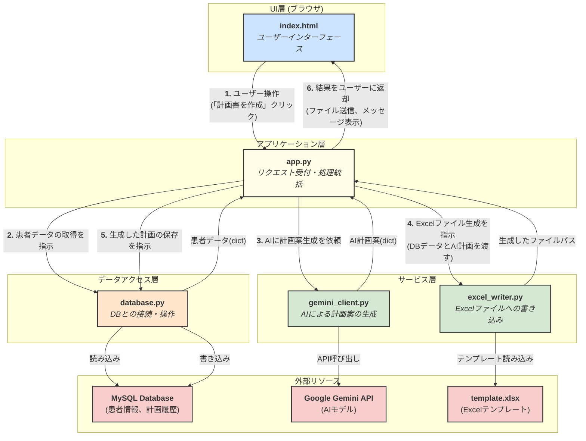

```mermaid
%%{init:{
  'securityLevel':'loose',
  'flowchart':{ 'htmlLabels':true },
  'theme':'default',
  'themeVariables':{ 'fontSize':'18px', 'actorFontSize':'18px', 'noteFontSize':'16px' }
}}%%

graph TD
    subgraph "UI層 (ブラウザ)"
        A["<b>index.html</b><br/><i>ユーザーインターフェース</i>"]
    end

    subgraph "アプリケーション層"
        B["<b>app.py</b><br/><i>リクエスト受付・処理統括</i>"]
    end

    subgraph "サービス層"
        C["<b>gemini_client.py</b><br/><i>AIによる計画案の生成</i>"]
        D["<b>excel_writer.py</b><br/><i>Excelファイルへの書き込み</i>"]
    end

    subgraph "データアクセス層"
        E["<b>database.py</b><br/><i>DBとの接続・操作</i>"]
    end

    subgraph "外部リソース"
        F["<b>MySQL Database</b><br/>(患者情報、計画履歴)"]
        G["<b>Google Gemini API</b><br/>(AIモデル)"]
        H["<b>template.xlsx</b><br/>(Excelテンプレート)"]
    end

    %% --- 処理フロー ---
    A -- "<b>1.</b> ユーザー操作<br/>(「計画書を作成」クリック)" --> B;

    B -- "<b>2.</b> 患者データの取得を指示" --> E;
    E -- "読み込み" --> F;
    E -- "患者データ(dict)" --> B;

    B -- "<b>3.</b> AIに計画案生成を依頼" --> C;
    C -- "API呼び出し" --> G;
    C -- "AI計画案(dict)" --> B;

    B -- "<b>4.</b> Excelファイル生成を指示<br/>(DBデータとAI計画を渡す)" --> D;
    D -- "テンプレート読み込み" --> H;
    D -- "生成したファイルパス" --> B;

    B -- "<b>5.</b> 生成した計画の保存を指示" --> E;
    E -- "書き込み" --> F;

    B -- "<b>6.</b> 結果をユーザーに返却<br/>(ファイル送信、メッセージ表示)" --> A;
    
    %% --- スタイルの定義 ---
    style A fill:#cde4ff,stroke:#333,stroke-width:2px
    style B fill:#fffde7,stroke:#333,stroke-width:2px
    style C fill:#d5e8d4,stroke:#333,stroke-width:2px
    style D fill:#d5e8d4,stroke:#333,stroke-width:2px
    style E fill:#ffe6cc,stroke:#333,stroke-width:2px
    style F fill:#f8cecc,stroke:#333,stroke-width:2px
    style G fill:#f8cecc,stroke:#333,stroke-width:2px
    style H fill:#f8cecc,stroke:#333,stroke-width:2px
```